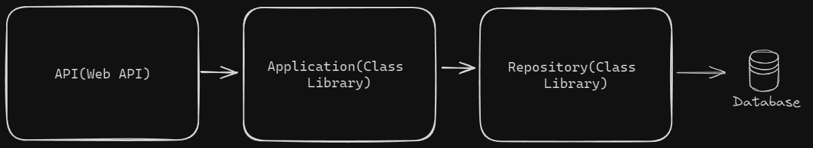

# ApiTareas

ApiTareas es un proyecto desarrollado para gestionar tareas. Esta solución, basada en una API REST, fue implementada utilizando ASP.NET Core y Entity Framework Core, aplicando los principios de arquitectura limpia.

## Arquitectura

El proyecto está estructurado en diferentes capas y bibliotecas de clases que interactúan entre sí para manejar las funciones de la aplicación. A continuación, se detallan los componentes principales.



## Instalación

### Requisitos basicos

- SDK .NET 8.0 o superior
- SQL Server u otro servidor compatible

### Pasos

1. **Clona el repositorio**:
    ```bash
    git clone https://github.com/frackfernandez/ApiTareas.git
    cd ApiTareas
    ```

2. **Restaura las dependencias**:
    ```bash
    dotnet restore
    ```

3. **Configurar la cadena de conexión de la base de datos:**

    Abre el archivo `appsettings.json` en la carpeta `API` y actualiza la cadena de conexión.

4. **Aplicar migraciones y actualiza la base de datos:**

    Ejecuta el siguiente comando para aplicar las migraciones a la base de datos:

    ```bash
    dotnet ef database update --project Repository
    ```

    Alternativamente, si prefieres ejecutar la migración manualmente en tu PC, puedes utilizar los siguientes comandos en la consola del administrador de paquetes o en la terminal de comandos:

    Crear la migración:

    ```bash
    Add-Migration Inicial -Project Repository
    ```

    Aplicar la migración a la base de datos:

    ```bash
    Update-Database -Project Repository

5. **Compila el proyecto**:
    ```bash
    dotnet build
    ```

## Contribuciones

Se agradecen las contribuciones. Por favor, sigue el proceso habitual en GitHub para realizar un fork, crea una rama, haz los cambios y envía un pull request.

## Licencia

Este proyecto está bajo la [MIT License](https://opensource.org/licenses/MIT).
